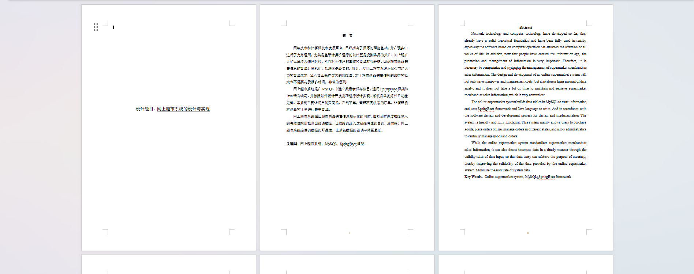
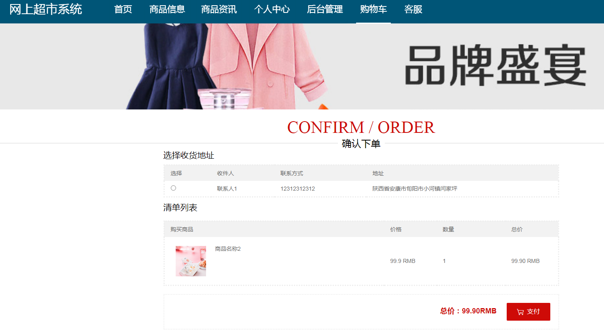
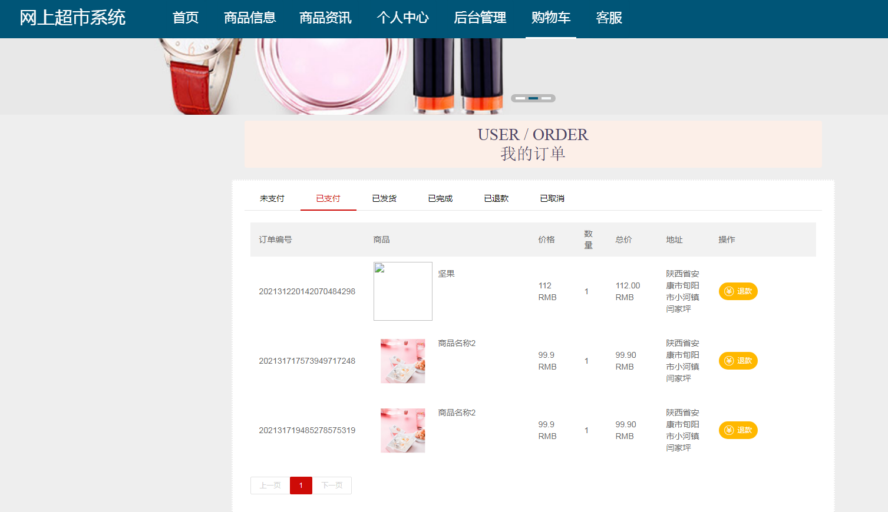
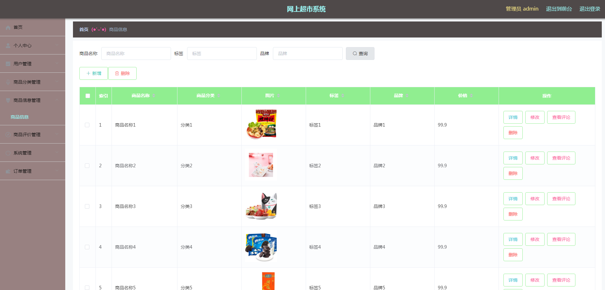
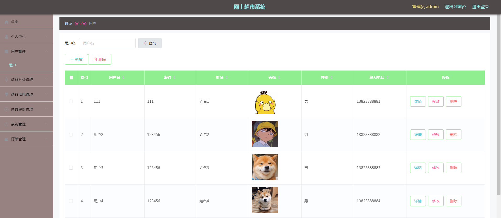

基于Springboot的网上超市（程序+论文）
=
### 完整代码获取地址：从戎源码网 ([https://armycodes.com/](https://armycodes.com/))
### 作者微信：19941326836  QQ：952045282 
### 承接计算机毕业设计、Java毕业设计、Python毕业设计、深度学习、机器学习
### 选题+开题报告+任务书+程序定制+安装调试+论文+答辩ppt 一条龙服务
### 所有选题地址https://github.com/nature924/allProject

一、项目介绍
---
系统包含两种角色：用户、管理员，系统分为前台和后台两大模块，主要功能如下：

### 1 管理员功能实现

商品信息管理  
管理员可以通过提交商品名称查询商品，并查看该商品的用户评论信息。  

用户管理  
管理员通过提交用户名来获取用户资料，对有异常情况的用户信息进行修改，并可以详细查看用户资料。  

商品评价管理  
管理员审核用户对商品的评价，经过审核的评价才会显示，并可以统计商品评价信息。  

已支付订单  
管理员查看已支付的订单，并逐个进行订单发货。  

### 2 用户功能实现

商品信息  
用户可以收藏、立即购买商品，或对商品进行评价，同时将商品添加到购物车。  

购物车  
用户可以直接下单购买购物车中的商品，或删除购物车中的商品。  

确认下单  
用户选择地址，查看支付金额信息，以确认订单之前的所有细节。  

已支付订单  
用户查看已支付的订单，若对购买商品产生后悔，可以申请退款。

二、项目技术
---
- 编程语言：Java
- 数据库：MySQL
- 项目管理工具：Maven
- 前端技术：VUE、HTML、Jquery、Bootstrap
- 后端技术：Spring、SpringMVC、MyBatis

三、运行环境
---
- 操作系统：Windows、macOS都可以
- JDK版本：JDK1.8以上都可以
- 开发工具：IDEA、Ecplise、Myecplise都可以
- 数据库: MySQL5.7以上都可以
- Tomcat：任意版本都可以
- Maven：任意版本都可以

四、运行截图
---
### 论文截图：

### 程序截图：

